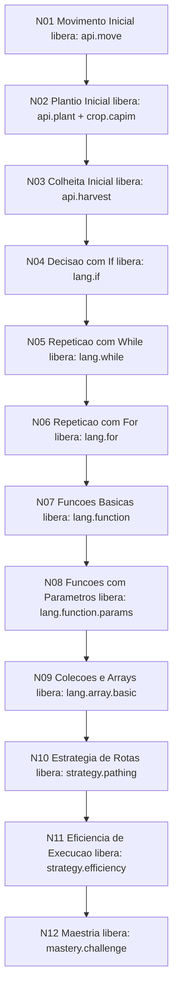

# GAME_PROGRESSION_V1

Documento V1 de design do jogo: direcao, metas, arvore de progressao, desbloqueios e missoes.

## 1. Objetivo do Jogo

Treinar logica de programacao por progressao guiada:

- O jogador aprende conceitos em etapas (if, loops, funcoes, arrays).
- Cada etapa tem missoes validaveis por eventos do jogo.
- Cada no libera features de linguagem/API para evolucao controlada.

## 2. Loop de Jogo

1. Receber missao ativa.
2. Escrever script.
3. Executar script.
4. Cumprir objetivo.
5. Concluir missao e liberar no seguinte.
6. Repetir com desafio maior.

## 3. Arvore V1 (12 Nos)



## 4. Nos, Requisitos e Recompensas

| No | Nome | Ramo | Requisito de Abertura | Recompensa/Unlock |
|---|---|---|---|---|
| N01 | Movimento Inicial | fundamentos | Inicio do jogo | api.move |
| N02 | Plantio Inicial | fundamentos | N01 completo | api.plant, crop.capim |
| N03 | Colheita Inicial | fundamentos | N02 completo | api.harvest |
| N04 | Decisao com If | logica | N03 completo | lang.if, comparacao basica |
| N05 | Repeticao com While | logica | N04 completo | lang.while |
| N06 | Repeticao com For | logica | N05 completo | lang.for |
| N07 | Funcoes Basicas | abstracao | N06 completo | lang.function |
| N08 | Funcoes com Parametros | abstracao | N07 completo | lang.function.params |
| N09 | Colecoes e Arrays | abstracao | N08 completo | lang.array.basic |
| N10 | Estrategia de Rotas | otimizacao | N09 completo | strategy.pathing |
| N11 | Eficiencia de Execucao | otimizacao | N10 completo | strategy.efficiency |
| N12 | Maestria | maestria | N11 completo | mastery.challenge |

## 5. Missoes Iniciais (20)

### N01 Movimento Inicial

| Missao | Objetivo | Validacao |
|---|---|---|
| M01 Primeiro Script | Execute seu primeiro script | runs >= 1 |
| M02 Mover no Mapa | Realize 6 movimentos | moves >= 6 |

### N02 Plantio Inicial

| Missao | Objetivo | Validacao |
|---|---|---|
| M03 Primeiro Plantio | Plante 3 culturas no total | plants >= 3 |
| M04 Capim em Escala | Plante 2 unidades de capim | plantsByCrop.capim >= 2 |

### N03 Colheita Inicial

| Missao | Objetivo | Validacao |
|---|---|---|
| M05 Primeira Colheita | Realize 1 colheita valida | harvests >= 1 |
| M06 Ciclo Plantar-Colher | Alcance 6 plantios e 2 colheitas | plants >= 6 e harvests >= 2 |

### N04 Decisao com If

| Missao | Objetivo | Validacao |
|---|---|---|
| M07 Rotina Estavel | Execute scripts 4 vezes | runs >= 4 |
| M08 Decisao de Campo | Atinga 14 movimentos e 8 plantios | moves >= 14 e plants >= 8 |

### N05 Repeticao com While

| Missao | Objetivo | Validacao |
|---|---|---|
| M09 Cadencia de Execucao | Execute scripts 8 vezes | runs >= 8 |
| M10 Ritmo de Repeticao | Realize 25 movimentos | moves >= 25 |

### N06 Repeticao com For

| Missao | Objetivo | Validacao |
|---|---|---|
| M11 Plantio em Serie | Realize 15 plantios | plants >= 15 |
| M12 Colheita em Serie | Realize 5 colheitas validas | harvests >= 5 |

### N07 Funcoes Basicas

| Missao | Objetivo | Validacao |
|---|---|---|
| M13 Diversidade Basica | Plante 2 tipos distintos | uniqueCrops >= 2 |
| M14 Arvore no Campo | Plante 3 arvores | plantsByCrop.arvore >= 3 |

### N08 Funcoes com Parametros

| Missao | Objetivo | Validacao |
|---|---|---|
| M15 Diversidade Intermediaria | Plante 3 tipos distintos | uniqueCrops >= 3 |
| M16 Trigo Controlado | Plante 4 trigos | plantsByCrop.trigo >= 4 |

### N09 Colecoes e Arrays

| Missao | Objetivo | Validacao |
|---|---|---|
| M17 Milho em Lote | Plante 4 milhos | plantsByCrop.milho >= 4 |

### N10 Estrategia de Rotas

| Missao | Objetivo | Validacao |
|---|---|---|
| M18 Rotas de Producao | Alcance 40 movimentos e 25 plantios | moves >= 40 e plants >= 25 |

### N11 Eficiencia de Execucao

| Missao | Objetivo | Validacao |
|---|---|---|
| M19 Ritmo Eficiente | Execute 15 scripts e colha 10 vezes | runs >= 15 e harvests >= 10 |

### N12 Maestria

| Missao | Objetivo | Validacao |
|---|---|---|
| M20 Dominio da Fazenda | 60 movimentos, 30 plantios, 12 colheitas | moves >= 60, plants >= 30, harvests >= 12 |

## 6. Mapeamento de Implementacao (Codigo)

### Core de Progressao

- Arquivo: [src/core/gamePhases.js](src/core/gamePhases.js)
- Estruturas principais:
  - `MISSION_TREE_NODES_V1`: 12 nos
  - `INITIAL_MISSIONS_V1`: 20 missoes
- Funcoes principais:
  - `recordEvent(type, payload)` para atualizar progresso
  - `getMissionTree()` para renderizar arvore completa
  - `getMissions()` para listar missoes com status
  - `getActiveMissions(limit)` para UI de foco
  - `getUnlockedFeatures()` para futuro bloqueio de linguagem

### Integracao Runtime

- Arquivo: [src/main.js](src/main.js)
- Eventos que alimentam progresso:
  - `move` ao mover com sucesso
  - `plant` ao plantar (com `cropType`)
  - `harvest` apenas quando colheita valida
  - `run` ao clicar em executar script

### API Global para prototipagem

No console do navegador:

```javascript
window.gamePhases.getCurrent();
window.gamePhases.getAll();
window.gamePhases.getTree();
window.gamePhases.getMissions();
window.gamePhases.getActiveMissions(5);
window.gamePhases.getUnlockedFeatures();
window.gamePhases.advance();
window.gamePhases.setPhase("n06_loop_for");
window.gamePhases.resetProgress();
```

## 7. Proximo Passo (apos aprovar V1)

1. Ligar bloqueios de linguagem por feature desbloqueada:
- `lang.if`
- `lang.while`
- `lang.for`
- `lang.function`
- `lang.array.basic`

2. Criar UI da arvore/missoes:
- painel lateral com no atual
- lista de missoes ativas
- progresso visual por no

## 8. Estado Atual e Limitacoes Remanescentes

### 8.1 Funcionalidades Ativas (v1.1.0-beta)

As itens abaixo estavam listados como limitacoes em versoes anteriores e estao agora plenamente implementados:

1. **Movimentacao parametrizada:** `mover("direita")` substituiu as funcoes individuais definitivamente. Aliases EN (`move("right")`) tambem funcionam.

2. **Console de debug sandboxado:** `console.log()`, `console.warn()`, `console.error()`, `console.info()` disponiveis no script do jogador. Saida exclusivamente no Log de Execucao da UI — sem vinculo com `window.console`.

3. **Sensores sincronos (Canal 2):** `obterCultura()`, `obterSolo()`, `posicaoX()`, `posicaoY()`, `verificarMaturidade()`, `tamanhoCampoX()`, `tamanhoCampoY()`, `contarItem()`, `turnoAtual()` — todos retornam valores reais da sandbox.

4. **Validacoes de plantio:** Feature lock (`plantar("trigo")` bloqueado se crop.trigo nao desbloqueado), compatibilidade de solo por cultura, validacao de maturidade na colheita.

5. **Efeitos reais de upgrades:** Velocidade de drone (tier × 20%), velocidade de crescimento de cultura (tier × 15%), yield por colheita (N itens por tier).

6. **Persistencia completa:** Mundo + progressao + UI salvos automaticamente no localStorage ao fechar/recarregar.

7. **Bloqueio de linguagem pela arvore:** `getUnlockedFeatures()` ja e consultado pelo gameController para as restricoes de plantio. Restricoes de constructs de linguagem (if/while/for) aguardam integracao futura.

### 8.2 Limitacoes Remanescentes

1. Runtime com JS-Interpreter 6.0.1:
- Nao suporta todo JavaScript moderno nativamente.
- `let/const` convertidos para `var` automaticamente.
- Template literals (backticks) nao suportados.

2. **Math.\* nao injetado na sandbox** (P0 do roadmap):
- `Math.floor`, `Math.sqrt`, `Math.random`, etc. nao estao disponiveis no script do jogador.
- Workaround: logica manual (ex: divisao inteira com `Math.floor` nao disponivel).

3. **Multiplos drones nao renderizados** (P1 do roadmap):
- Upgrades `game.drone.extra` existem na arvore mas nenhum segundo drone e exibido no campo.

4. Progresso atual e por metricas globais:
- Missoes validam eventos acumulados.
- Ainda nao existem missoes com validacao por mapa/posicao/tempo por script.

5. UI de arvore sem pan/zoom por gesto:
- Atualmente usa scroll horizontal/vertical.
- Em telas pequenas pode exigir mais navegacao manual.

### 8.3 Upgrades Priorizados

1. **P0 — Math.\* na sandbox:**
- Injetar `Math.floor`, `Math.ceil`, `Math.round`, `Math.abs`, `Math.sqrt`, `Math.min`, `Math.max`, `Math.pow`, `Math.PI` em `initApi()`.

2. **P1 — Segundo drone visual:**
- Conectar upgrade `game.drone.extra.t1` a instancia adicional de avatar no Three.js.

3. Upgrade de tutorial guiado por missao:
- Expandir conteudo didatico com exemplos contextuais por objetivo.
- Adicionar dicas dinamicas com base no erro de sintaxe/runtime.

4. Upgrade de validacao de missao:
- Adicionar tipos de validacao por sequencia de acoes e por eficiencia.

5. Upgrade visual da arvore:
- Pan/zoom.
- Destaque animado de caminho desbloqueado.
- Icones por categoria e estado.
